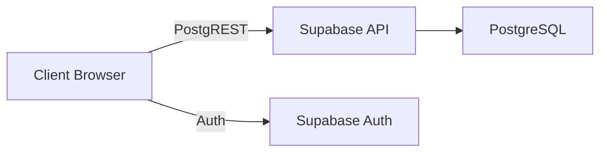

# HostelHub - Smart Hostel Management System

A modern, glassmorphic single-page application for managing university hostels. Built with Vite, vanilla JavaScript, and Supabase.

## Architecture Overview

HostelHub uses a Backend-as-a-Service (BaaS) architecture with Supabase, entirely eliminating the need for a custom Node.js backend. 

- **Frontend**: Vite + Vanilla JS, SPA routing, ES Modules
- **Backend/Database**: Supabase (PostgreSQL)
- **Data Access**: Supabase JS Client (REST over HTTP)
- **Security**: PostgreSQL Row Level Security (RLS) restricts data access per user directly in the database.

## Features

1. **Dashboard**: Unified view of allocations, pending dues, and announcements.
2. **My Room**: Read-only view of current room allocation and roommates (privacy-safe).
3. **Complaints**: File and track maintenance, noise, and cleanliness issues.
4. **Fees**: Read-only tracking of paid, due, and overdue hostel fees.
5. **Leave Requests**: Request time off and check approval status.
6. **Announcements**: Read global or hostel-specific announcements broadcasted by wardens/admins.

## Setup Instructions

1. **Prerequisites**: Node.js 18+, npm, and a Supabase account.
2. **Clone repo**: `git clone <repo-url> && cd hostel-management`
3. **Install dependencies**: `npm install`
4. **Supabase Setup**:
   - Create a new Supabase project.
   - In Auth settings, enable Email/Password login and ensure 12-character minimum password is set (if desired).
5. **Database Initialization**:
   - Navigate to the SQL Editor in Supabase.
   - Run the schema and migration files in order:
     - `001_schema.sql`
     - `002_rls_policies.sql`
     - `003_rpc_functions.sql`
     - `004_seed.sql` (optional, for test data)
6. **Environment Variables**:
   - Create a `.env` file from `.env.example`: `cp .env.example .env`
   - Fill in `VITE_SUPABASE_URL` and `VITE_SUPABASE_ANON_KEY` from your Supabase project API settings.
7. **Run Development Server**: `npm run dev`
8. **First Admin User**:
   - Sign up a new user via the app.
   - Go to Supabase Table Editor -> `profiles` table.
   - Manually change the `role` of your user from `student` to `admin`.

## Deployment (Vercel)

1. Connect your GitHub repository to Vercel.
2. Add `VITE_SUPABASE_URL` and `VITE_SUPABASE_ANON_KEY` as Environment Variables in the Vercel dashboard.
3. Deploy! Vercel will automatically run `npm run build` using the Vite config.

## Security Architecture

- **Row Level Security (RLS)**: Enforced on all tables. Users can only fetch data they own (e.g. students can only see their own complaints and fees).
- **Separate READ/WRITE policies**: Granular control ensures students can insert complaints but not update status.
- **CHECK constraints**: Strict enums in DB (e.g., status in 'due', 'paid', 'overdue').
- **SECURITY DEFINER RPCs**: Used for privileged operations where client shouldn't have direct table access.
- **XSS Prevention**: DOM manipulations rely exclusively on `textContent` and `createElement` for user-generated data. `innerHTML` is only used for hardcoded, developer-written structural templates (like modal forms) or to clear containers (`innerHTML = ''`).

## Database Schema

- `profiles`: User information and role (admin, warden, student)
- `hostels`: Building information
- `rooms`: Rooms within hostels, tracks `occupied_count`
- `room_allocations`: Maps students to rooms, handles active/vacated status
- `complaints`: Student-filed issues linked to their room
- `fee_payments`: Financial tracking per student
- `leave_requests`: Student leave requests
- `announcements`: Global or hostel-wide broadcasts

## Roles & Permissions

| Table | Admin | Warden | Student |
|---|---|---|---|
| `profiles` | ALL | READ ALL | READ SELF |
| `hostels` | ALL | READ ALL | READ ALL |
| `rooms` | ALL | READ ALL | READ ALL |
| `room_allocations`| ALL | ALL | READ SELF |
| `complaints` | ALL | ALL | INSERT / READ SELF |
| `fee_payments` | ALL | READ ALL | READ SELF |
| `leave_requests` | ALL | ALL | INSERT / READ SELF |
| `announcements` | ALL | ALL | READ |

## Verification

To verify security measures:
1. Try executing a Supabase query from browser DevTools as a student to update your fee payment status. RLS will block it.
2. Monitor `rooms.occupied_count` when inserting/updating/deleting `room_allocations`. It will update automatically via database triggers.
3. Submit a complaint with HTML tags `` and view the complaints page. The tags will render safely as plain text due to `textContent` rendering.
